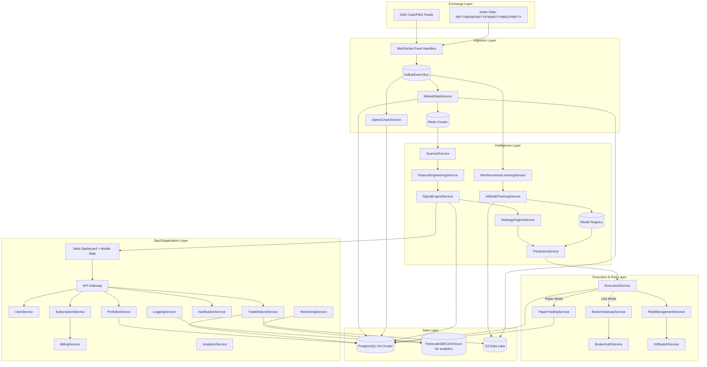
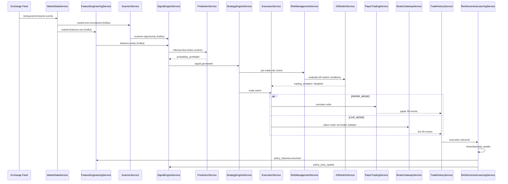
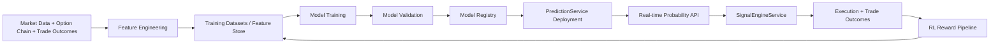

# Production-Grade AI Options Trading SaaS (India) - Architecture Blueprint

## 1) System Architecture Diagram



---

## 2) Microservices Architecture (~25 Services)

| # | Service | Responsibility | Storage | External Dependencies |
|---|---|---|---|---|
| 1 | API Gateway | Single entrypoint, authn/authz enforcement, rate limits, WebSocket fanout routing | Redis cache | Kong/Envoy, OIDC |
| 2 | MarketDataService | Consume real-time ticks/candles, normalize, publish market events | Redis + PG + S3 | Exchange feed adapters |
| 3 | OptionChainService | Build option chain snapshots, Greeks, IV term structure | Redis + PG | MarketDataService |
| 4 | ScannerService | Universe scan: top gainers/losers, index movers, F&O liquidity filters | Redis + PG | Kafka |
| 5 | SignalEngineService | Compute AI-assisted option signals from features + probabilities | PG | PredictionService |
| 6 | StrategyEngineService | Strategy templates/rules (breakout, mean reversion, IV crush) and policy gating | PG | SignalEngineService |
| 7 | FeatureEngineeringService | Build online/offline features (OI, PCR, IV delta, momentum, VWAP dev) | Feature store | Kafka, Redis |
| 8 | AIModelTrainingService | Scheduled and drift-triggered model training + validation + registry promotion | S3 + registry metadata | SageMaker/EKS jobs |
| 9 | PredictionService | Low-latency inference API for profitability probability | Redis model cache | Model registry |
| 10 | ReinforcementLearningService | Policy optimization from execution outcomes and reward shaping | S3 + PG | Training pipeline |
| 11 | PaperTradingService | Execution simulator with slippage, latency, partial fills | PG | ExecutionService |
| 12 | ExecutionService | Order orchestration, live/paper switch, pre/post trade checks | PG + Redis | BrokerGatewayService |
| 13 | BrokerGatewayService | Unified broker abstraction for orders/positions | PG | Zerodha/Upstox/Dhan/Flattrade/Shoonya/Kotak |
| 14 | BrokerAuthService | OAuth/session/token lifecycle per broker, encrypted secrets | KMS-backed vault | Broker APIs |
| 15 | RiskManagementService | Real-time limits: daily loss, position size, open trades, volatility filter | Redis + PG | PortfolioService |
| 16 | KillSwitchService | Hard stop execution globally/per-user strategy on trigger | Redis + PG | RiskManagementService |
| 17 | UserService | User profile, KYC metadata, MFA, role model | PG | Auth provider |
| 18 | SubscriptionService | Plan entitlements, feature flags, usage quotas | PG | BillingService |
| 19 | BillingService | Payment gateway integration, invoices, retries, dunning | PG | Razorpay/Stripe |
| 20 | NotificationService | Multi-channel notifications (email/SMS/push/Telegram) | PG | SES/Twilio/FCM |
| 21 | PortfolioService | Position/PnL aggregation, Greeks exposure, margin utilization | Redis + PG | BrokerGatewayService |
| 22 | TradeHistoryService | Executions, fills, order lifecycle audit trail | PG + S3 archive | ExecutionService |
| 23 | AnalyticsService | SaaS KPIs + trading analytics + user cohorts | OLAP | PG + Kafka |
| 24 | LoggingService | Structured logs ingestion and retention | OpenSearch/S3 | Fluent Bit |
| 25 | MonitoringService | Metrics, tracing, alerting, SLO monitoring | Prometheus/Grafana/Tempo | All services |

---

## 3) Service Interaction Diagram (Event-Driven)



### Core Kafka Topics
- `market.tick.normalized`
- `market.optionchain.delta`
- `scanner.opportunity`
- `features.ready`
- `signal.generated`
- `trade.intent`
- `order.lifecycle`
- `execution.outcome`
- `risk.alert`
- `killswitch.triggered`
- `model.training.requested`
- `model.deployed`

---

## 4) Codebase Folder Structure

```text
algosaas/
├── docs/
│   ├── production-architecture.md
│   ├── deployment-guide.md
│   └── dashboard-layout.md
├── services/
│   ├── api-gateway/
│   ├── market-data-service/
│   ├── option-chain-service/
│   ├── scanner-service/
│   ├── signal-engine-service/
│   ├── strategy-engine-service/
│   ├── feature-engineering-service/
│   ├── ai-model-training-service/
│   ├── prediction-service/
│   ├── reinforcement-learning-service/
│   ├── paper-trading-service/
│   ├── execution-service/
│   ├── broker-gateway-service/
│   ├── broker-auth-service/
│   ├── risk-management-service/
│   ├── kill-switch-service/
│   ├── user-service/
│   ├── subscription-service/
│   ├── billing-service/
│   ├── notification-service/
│   ├── portfolio-service/
│   ├── trade-history-service/
│   ├── analytics-service/
│   ├── logging-service/
│   └── monitoring-service/
├── ml/
│   ├── features/
│   ├── models/
│   ├── pipelines/
│   └── rl/
├── database/
│   └── schema.sql
├── infra/
│   ├── aws/
│   ├── terraform/
│   ├── k8s/
│   └── observability/
├── shared/
│   ├── events/
│   ├── schemas/
│   └── libs/
└── frontend/
    └── dashboard/
```

---

## 5) Database Schema (PostgreSQL)

See `database/schema.sql` for production DDL, indexing, partition-ready design.

Key entities:
- `users`
- `subscriptions`
- `billing_invoices`
- `broker_connections`
- `signals`
- `orders`
- `trades`
- `positions`
- `market_ticks`
- `option_chain_snapshots`
- `ai_training_dataset`
- `model_registry`
- `risk_events`
- `killswitch_events`

---

## 6) AI Pipeline Architecture



Feature set:
- OI change (absolute + percentage)
- Put-Call Ratio (global + strike-local)
- Greeks (delta/gamma/theta/vega/rho)
- IV changes (term and skew movement)
- Momentum indicators (RSI, MACD histogram, ATR breakout)
- Volume spikes (z-score against rolling baseline)
- VWAP deviation

Model families:
- Random Forest
- Gradient Boosting (XGBoost/LightGBM)
- Neural Networks (tabular MLP + temporal encoder)

Prediction API output:
- `probability_profitable` (0..1)
- `expected_move`
- `confidence_interval`
- `model_version`

---

## 7) Broker Gateway Design

Unified interface contract:

```yaml
place_order:
  input:
    broker_account_id: uuid
    symbol: string
    instrument_type: OPTION
    strike: number
    option_type: CE|PE
    side: BUY|SELL
    qty: integer
    order_type: MARKET|LIMIT|SL|SLM
    price: number?
    trigger_price: number?
  output:
    broker_order_id: string
    status: ACCEPTED|REJECTED
    rejection_reason: string?
```

Adapters implemented:
- Zerodha adapter
- Upstox adapter
- Dhan adapter
- Flattrade adapter
- Shoonya adapter
- Kotak Neo adapter

Security:
- Broker access tokens encrypted using envelope encryption (AWS KMS + app-level AES-GCM).
- Refresh tokens stored in vault table with rotation metadata.
- Per-user scoped secrets; no plaintext credentials in logs.

---

## 8) Frontend Dashboard Layout

Panels:
1. Market Scanner Panel (indices + top gainers/losers + F&O screener)
2. Signal Panel (symbol/strike/CE-PE/entry/SL/target/AI probability)
3. Option Chain & Greeks Surface
4. Trade Execution Panel (manual + auto mode)
5. Portfolio & Risk Panel (PnL, drawdown, margin, exposure)
6. AI Probability/Model Insight Panel

UX requirements:
- Dark mode default + light mode toggle
- Drag/drop widget customization with persisted layout
- Real-time updates via WebSocket channels
- Live/Paper global mode switch with visible banner and confirmation step

---

## 9) AWS Deployment Guide (High Scale)

Reference: `docs/deployment-guide.md`

High-level production stack:
- **Compute**: EKS (primary), EC2 node groups for low-latency execution workloads
- **Edge**: ALB + API Gateway + WAF
- **Data**: RDS PostgreSQL Multi-AZ + read replicas, ElastiCache Redis cluster mode
- **Messaging**: MSK Kafka (3+ brokers, multi-AZ)
- **Storage**: S3 data lake + lifecycle tiers
- **Realtime**: Dedicated WebSocket deployment (autoscaled)
- **Observability**: Prometheus, Grafana, Loki/OpenSearch, Tempo/X-Ray
- **Security**: KMS, Secrets Manager, IAM roles for service accounts, GuardDuty, Security Hub

Scalability targets:
- 5k+ concurrent websocket clients per region (horizontal pods)
- 20k events/sec ingest burst via Kafka partitions
- p95 prediction latency < 80ms (in-region model serving)

